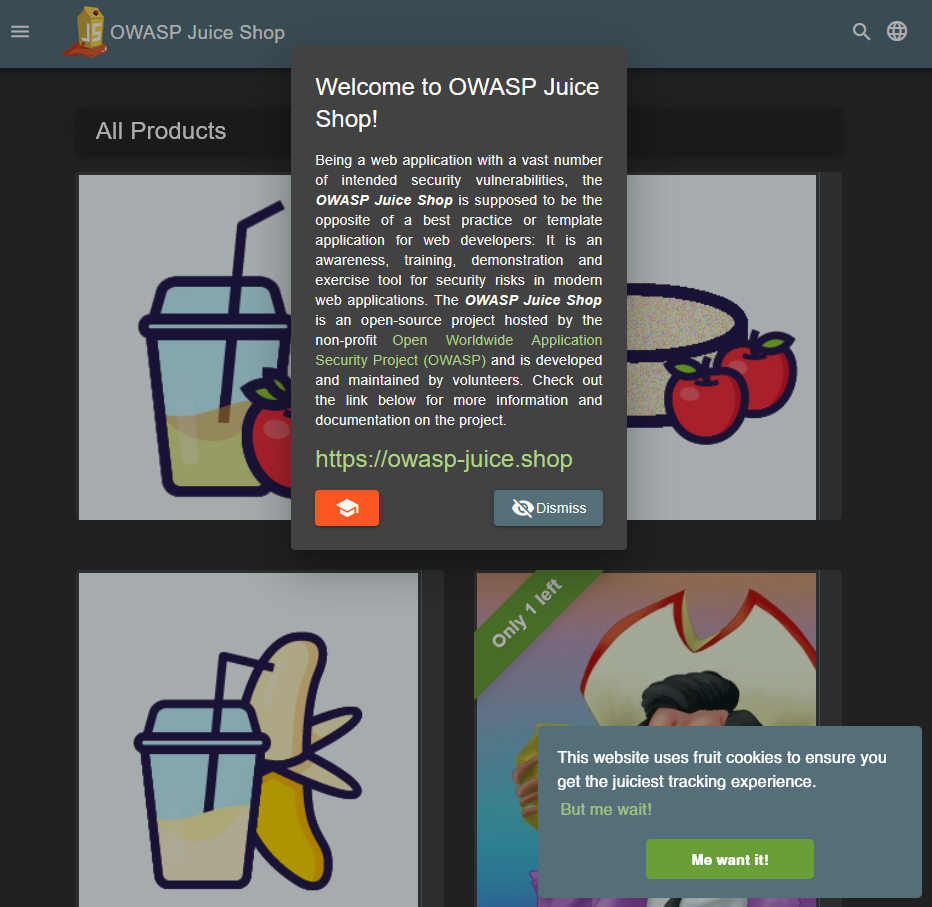

# Triage Report — OWASP Juice Shop

## Scope & Asset
- Asset: OWASP Juice Shop (local lab instance)
- Image: bkimminich/juice-shop:v19.0.0
- Release link/date: https://github.com/juice-shop/juice-shop/releases/tag/v19.0.0 —  Sep 4, 2025

## Environment
- Host OS: Windows 11
- Docker: v4.59.0

## Deployment Details
- Run command used: `docker run -d --name juice-shop -p 127.0.0.1:3000:3000 bkimminich/juice-shop:v19.0.0`
- Access URL: http://127.0.0.1:3000
- Network exposure: 127.0.0.1 only [x] Yes  [ ] No

## Health Check
- Page load screenshot:
  

- API check:
```nginx
<html>
  <head>
    <meta charset='utf-8'>
    <title>Error: Unexpected path: /rest/products</title>
    <style>* {
  margin: 0;
  padding: 0;
  outline: 0;
}
```

## Surface Snapshot (Triage)
- Login/Registration visible: [x] Yes [ ] No — notes: login and registration UI visible from navbar/menu
- Product listing/search present: [x] Yes [ ] No — notes: product cards and search field available
- Admin or account area discoverable: [x] Yes [ ] No — notes: account page exists; admin features appear after login/challenges
- Client-side errors in console: [ ] Yes [x] No

## Risks Observed (Top 3)
1) Injection (SQLi) — app intentionally contains injection issues; could lead to data exposure/modification.
2) Broken Authentication — weak auth/session handling can allow account takeover in vulnerable setups.
3) Security Misconfiguration / Missing Security Headers — weak/missing headers increase XSS/MITM risk.